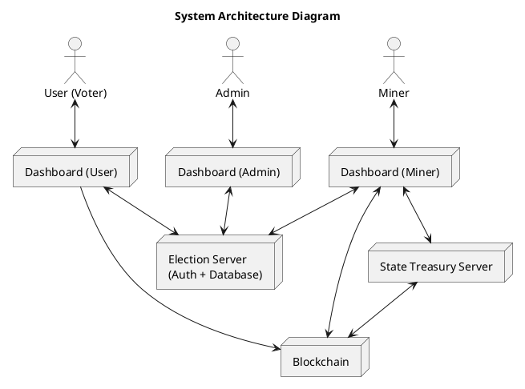

# diagram_SA

```plantuml

@startuml
title System Architecture Diagram

actor "User (Voter)" as User
actor "Admin" as Admin
actor "Miner" as Miner

node "Dashboard (User)" as UserDashboard
node "Dashboard (Admin)" as AdminDashboard
node "Dashboard (Miner)" as MinerDashboard

node "Election Server\n(Auth + Database)" as ElectionServer
node "Blockchain" as Blockchain
node "State Treasury Server" as Treasury

User <--> UserDashboard
Admin <--> AdminDashboard
Miner <--> MinerDashboard

UserDashboard <--> ElectionServer
AdminDashboard <--> ElectionServer
MinerDashboard <--> ElectionServer

UserDashboard --> Blockchain
MinerDashboard <--> Blockchain

MinerDashboard <--> Treasury
Treasury <--> Blockchain

@enduml
```

 
