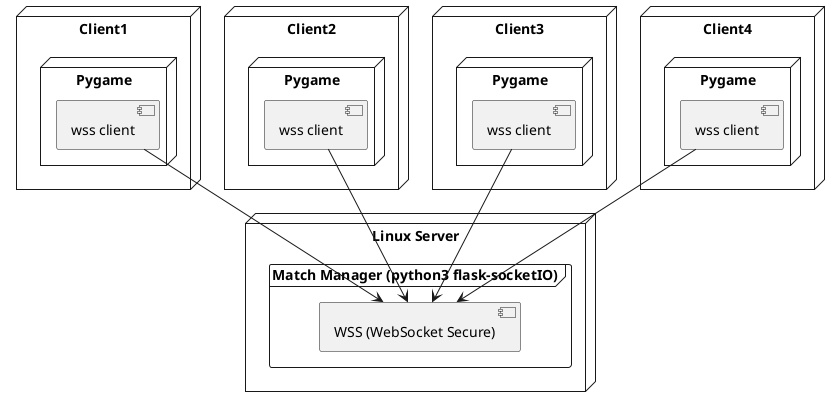

# plantuml_networkdiagram

```plantuml
@startuml

node "Linux Server" {
    frame "Match Manager (python3 flask-socketIO)" {
        component "WSS (WebSocket Secure)" as WSS
    }
}

node Client1 {
    node "Pygame" as c1 {
        component "wss client" as WB1
    }
}

node Client2 {
    node "Pygame" as c2 {
        component "wss client" as WB2
    }
}

node Client3 {
    node "Pygame" as c3 {
        component "wss client" as WB3
    }
}

node Client4 {
    node "Pygame" as c4 {
        component "wss client" as WB4
    }
}


WB1 --> WSS 
WB2 --> WSS 
WB3 --> WSS 
WB4 --> WSS 

@enduml
```
