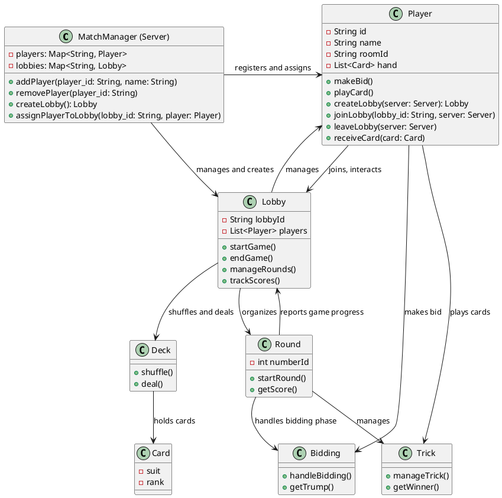

# class_diagram_bridge2

```plantuml
@startuml
top to bottom direction

class "MatchManager (Server)" as Server {
    - players: Map<String, Player>
    - lobbies: Map<String, Lobby>
    + addPlayer(player_id: String, name: String)
    + removePlayer(player_id: String)
    + createLobby(): Lobby
    + assignPlayerToLobby(lobby_id: String, player: Player)
}

class Lobby {
    - String lobbyId
    - List<Player> players
    + startGame()
    + endGame()
    + manageRounds()
    + trackScores()
}

class Player {
    - String id
    - String name
    - String roomId
    - List<Card> hand
    + makeBid()
    + playCard()
    + createLobby(server: Server): Lobby
    + joinLobby(lobby_id: String, server: Server)
    + leaveLobby(server: Server)
    + receiveCard(card: Card)
}

class Round {
    - int numberId
    + startRound()
    + getScore()
}

class Deck {
    + shuffle()
    + deal()
}

class Card {
    - suit
    - rank
}

class Bidding {
    + handleBidding()
    + getTrump()
}

class Trick {
    + manageTrick() 
    + getWinner()
}

Server -down-> Lobby : manages and creates
Server -right-> Player : registers and assigns

Player -down-> Lobby : joins, interacts

Lobby -up-> Player : manages 
Lobby --> Round : organizes
Lobby -down-> Deck : shuffles and deals

Player -down-> Trick : plays cards
Player -down-> Bidding : makes bid

Round --> Lobby : reports game progress
Round -down-> Trick : manages
Round -down-> Bidding : handles bidding phase
Deck -down-> Card : holds cards

@enduml
```
