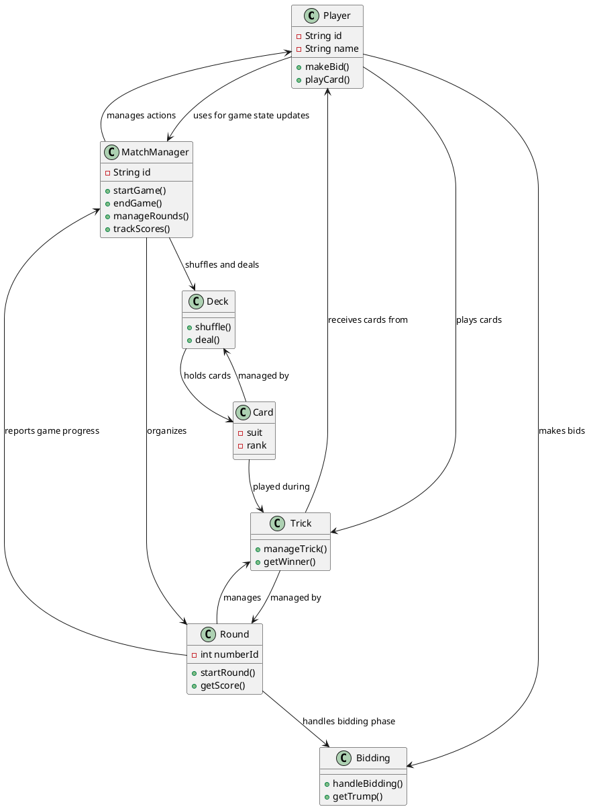

# BridgeClassDiagram

```plantuml
@startuml
class Player {
    - String id
    - String name
    + makeBid()
    + playCard()
}

class MatchManager {
    - String id
    + startGame()
    + endGame()
    + manageRounds()
    + trackScores()
}

class Round {
    - int numberId
    + startRound()
    + getScore()
}

class Deck {
    + shuffle()
    + deal()
}

class Card {
    - suit
    - rank
}

class Bidding {
    + handleBidding()
    + getTrump()
}

class Trick {
    + manageTrick() 
    + getWinner()
}

Player --> MatchManager : uses for game state updates
Player --> Bidding : makes bids
Player --> Trick : plays cards

MatchManager --> Player : manages actions
MatchManager --> Round : organizes
MatchManager --> Deck : shuffles and deals

Round --> Trick : manages
Round --> Bidding : handles bidding phase
Round --> MatchManager : reports game progress

Deck --> Card : holds cards

Card --> Trick : played during
Card --> Deck : managed by


Trick --> Player : receives cards from
Trick --> Round : managed by

@enduml
```
