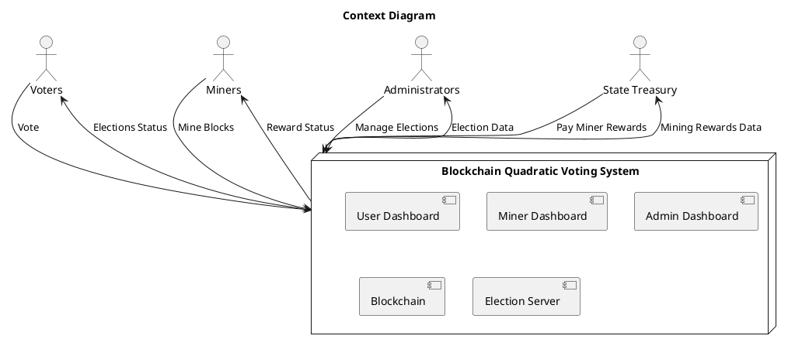

# context_diagram

```plantuml

@startuml
title Context Diagram 

actor "Voters" as Voters
actor "Miners" as Miners
actor "Administrators" as Admins
actor "State Treasury" as Treasury

node "Blockchain Quadratic Voting System" as System {
    [User Dashboard]
    [Miner Dashboard]
    [Admin Dashboard]
    [Blockchain]
    [Election Server]
}

Voters --> System : "Vote"
Miners --> System : "Mine Blocks"
Admins --> System : "Manage Elections"
Treasury --> System : "Pay Miner Rewards"

System --> Voters : "Elections Status"
System --> Miners : "Reward Status"
System --> Admins : "Election Data"
System --> Treasury : "Mining Rewards Data"

@enduml

```

