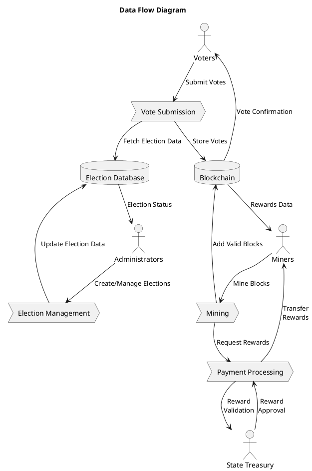

# data_flow_diagram_blockchainvotingsystem

```plantuml


@startuml
title Data Flow Diagram 

actor "Voters" as Voters
actor "Administrators" as Admins
actor "Miners" as Miners
actor "State Treasury" as Treasury

process "Vote Submission" as VoteProcess
process "Election Management" as ElectionProcess
process "Mining" as MiningProcess
process "Payment Processing" as PaymentProcess

database "Election Database" as ElectionDB
database "Blockchain" as BlockchainDB

Voters --> VoteProcess : "Submit Votes"
VoteProcess --> BlockchainDB : "Store Votes"
VoteProcess --> ElectionDB : "Fetch Election Data"
BlockchainDB --> Voters : "Vote Confirmation"

Admins --> ElectionProcess : "Create/Manage Elections"
ElectionProcess --> ElectionDB : "Update Election Data"
ElectionDB --> Admins : "Election Status"

Miners --> MiningProcess : "Mine Blocks"
MiningProcess --> BlockchainDB : "Add Valid Blocks"
BlockchainDB --> Miners : "Rewards Data"

MiningProcess --> PaymentProcess : "Request Rewards"
PaymentProcess --> Treasury : "Reward\nValidation"
Treasury --> PaymentProcess : "Reward\nApproval"
PaymentProcess --> Miners : "Transfer\nRewards"

@enduml

```
